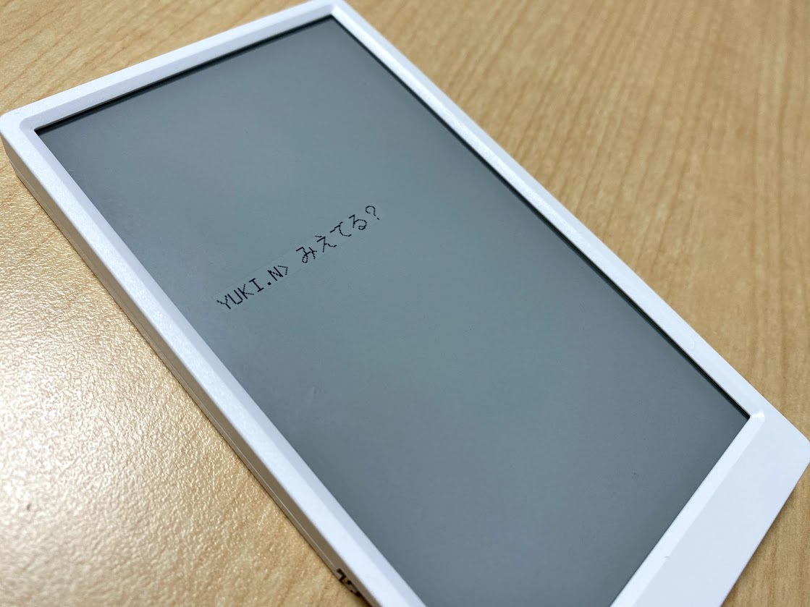

# 涼宮ハルヒの消失 for M5Paper

例のコンソールを表示するプログラムです。

LovyanGFXとPlatformioを使う際の参考になれば・・



## 書き込み方法

Platformioをインストールし下記を実行してください。

```
$ git clone git@github.com:inajob/m5paper-sos.git
$ cd m5paper-sos
$ platformio run --target upload
```
